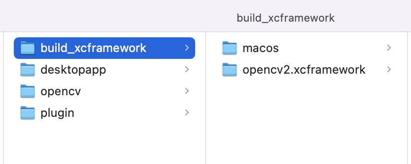

# native_opencv

- # 开发flutter 桌面版本
	- ## 创建项目
		- flutter config --enable-macos-desktop
		- flutter config --enable-windows-desktop
		- flutter config --enable-linux-desktop
		- flutter devices
		- flutter create desktopapp  // 创建项目
- ## dart::ffi 实现具有原生 OpenCV 支持的 Flutter 插件
	- 需要安装homebrew 、 python2、cmake(3.21 或更新版本)
	- 下载继承opencv
		- 参考文档 [[Integrating C library in a Flutter app using Dart FFI](https://medium.com/flutter-community/integrating-c-library-in-a-flutter-app-using-dart-ffi-38a15e16bc14)] 和 [[Integrating C library in a desktop Flutter app using Dart FFI](https://medium.com/flutter-community/integrating-c-library-in-a-desktop-flutter-app-using-dart-ffi-32560cb1169b)]
		- ios：
			- https://opencv.org/releases 下点击平台下载
			- 将下载下来的opencv2.framework放到插件的ios下，同级native_opencv.podspec下写上：
			-
			  ```
			  			    # 告诉 CocoaPods 不要删除框架
			  			    s.preserve_paths = 'opencv2.framework'
			  			    # 告诉链接器包含 opencv2 框架
			  			    s.xcconfig = { 'OTHER_LDFLAGS' => '-framework opencv2' }
			  			    # 包括 OpenCV 框架
			  			    s.vendored_frameworks = 'opencv2.framework'
			  			    # 包括原生框架
			  			    s.frameworks = 'AVFoundation'
			  			    # 包括 C++ 库
			  			    s.library = 'c++'
			  ```
			- 执行pod install刷新
		- macos：
			- git clone https://github.com/opencv/opencv
			- python3 ~/dev/lib/opencv/platforms/apple/build_xcframework.py --macos_archs=x86_64,arm64 --build_only_specified_archs --out ./build_xcframework
			- 生成如下：
			- 
			- 将opencv2.xcframework放到macos文件夹下，同级native_opencv.podspec下写上：
			-
			  ```
			  			  #   告诉 CocoaPods 不要删除框架
			  			     s.preserve_paths = 'opencv2.xcframework'
			  			  #   告诉链接器包含 opencv2 框架
			  			     s.xcconfig = { 'OTHER_LDFLAGS' => '-framework opencv2' }
			  			  #   包括 OpenCV 框架
			  			     s.vendored_frameworks = 'opencv2.xcframework'
			  			    # 包括原生框架
			  			    s.frameworks = 'AVFoundation', 'Accelerate', 'OpenCL'
			  			    # 包括 C++ 库
			  			    s.library = 'c++'
			  ```
			- 在example的macos下执行pod install，刷新podspec依赖
		- Android：
			-
		- Window：
			- https://opencv.org/releases 下点击平台下载，
			-
		- Linux：
			- Linux下的flutter记得用[[手动安装方式](https://docs.flutter.dev/get-started/install/linux#install-flutter-manually)]，不要使用snap，不然会clang link fail
				- 下载flutter_linux_x.x.x-stable.tar.xz
				- 解压
					-
					  ```
					  					  tar xf ~/Downloads/flutter_linux_3.3.0-stable.tar.xz
					  ```
				- 设置flutter环境变量
					-
					  ```
					  					  echo 'export PATH="$PATH:~/Downloads/flutter/bin"' >> ~/.bashrc
					  ```
			- 根据网站执行[official OpenCV website](https://docs.opencv.org/master/d7/d9f/tutorial_linux_install.html).
				-
				  ```
				  				  # Install minimal prerequisites (Ubuntu 18.04 as reference)
				  				  sudo apt update && sudo apt install -y cmake g++ wget unzip

				  				  # Download and unpack sources
				  				  wget -O opencv.zip https://github.com/opencv/opencv/archive/4.x.zip
				  				  unzip opencv.zip

				  				  # Create build directory
				  				  mkdir -p build && cd build

				  				  # Configure
				  				  cmake  ../opencv-4.x

				  				  # Build
				  				  cmake --build .
				  ```
			- 将OpenCV_DIR写进环境变量
				-
				-
				  ```
				  				  # 将OpenCV_DIR写进环境变量
				  				  echo 'export OpenCV_DIR=/home/west/dev/lib/opencv/build' >> ~/.bashrc
				  ```
				- 这里虽然写了，但是后续使用还是报错找不到OpenCVConifg.cmake，所以在插件linux下的cmakelist.text里写的还是
					-
					  ```
					  					  # set("OpenCV_DIR" $ENV{OpenCV_DIR})
					  					  set("OpenCV_DIR" /home/west/dev/lib/opencv/build)
					  ```
-